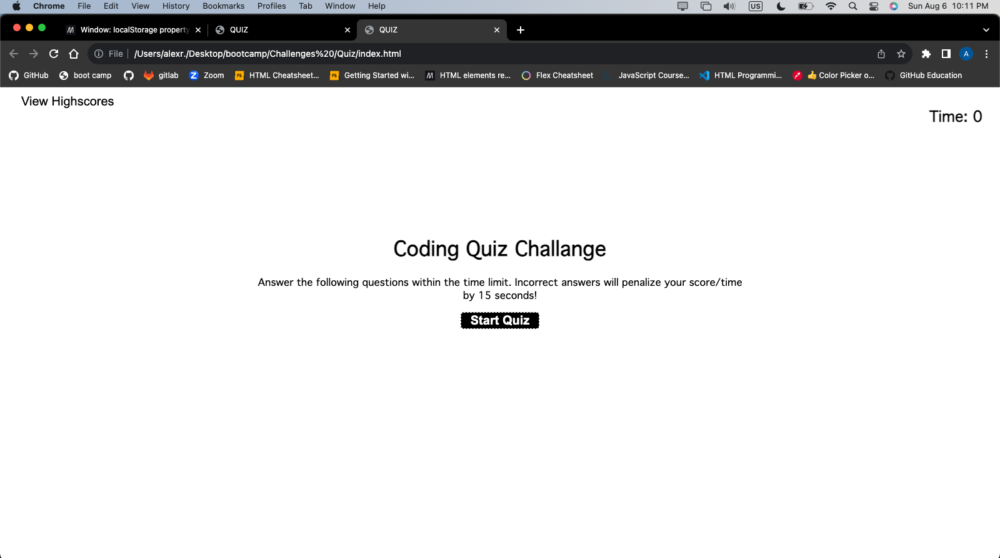

# 04 Web APIs: Code Quiz

## Description

Javascript Quiz game that allows user to test their knowledge. 

## Installation

N/A

## Usage
Javascript Quiz game. Once user starts quiz. Users is asked a multiple choice questions. While a timer is running. Every time the user enters a wrong answer, the user is deducted 15 seconds. If time runs out, quiz ends and user will be asked to enter name to store score and name . User name and score is stored in local storage. User may delete stored data and restart game.  

## Screenshot 

## Deployment link

https://ayrh1.github.io/Quiz/

## Credits

* [MDN Web Docs on localStorage](https://developer.mozilla.org/en-US/docs/Web/API/Window/localStorage)

* [MDN Web Docs on Window.localStorage](https://developer.mozilla.org/en-US/docs/Web/API/Window/localStorage)

* [MDN Web Docs on JSON.stringify()](https://developer.mozilla.org/en-US/docs/Web/JavaScript/Reference/Global_Objects/JSON/stringify)

*[MDN Web Docs on setInterval()](https://developer.mozilla.org/en-US/docs/Web/API/WindowOrWorkerGlobalScope/setInterval)

*[MDN Web Docs on clearInterval()](https://developer.mozilla.org/en-US/docs/Web/API/WindowOrWorkerGlobalScope/clearInterval)

## License

Please refer to the LICENSE in the repo.
